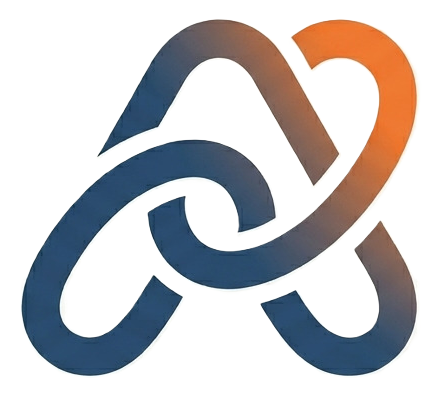

# 🦎 Axora - Remesas Inteligentes

> Plataforma de remesas internacionales con blockchain, Web3 e IA

[](https://github.com/RaulHernnan/Axora)
[](https://nextjs.org/)
[](https://sepolia.etherscan.io/)
[](https://soliditylang.org/)



---

<details>
<summary><b>📑 Tabla de Contenidos</b></summary>

- **[¿Qué es Axora?](#qué-es-axora)** - Conoce nuestra plataforma de remesas
- **[El Problema](#el-problema)** - Por qué existe Axora
- **[Características](#características)** - Lo que nos hace especiales
- **[Características Nuevas](#características-nuevas)** - NFTs, Token AMXN y más
- **[Cómo Funciona](#cómo-funciona)** - Flujo de la plataforma
- **[Comparativa de costos](#comparativa-de-costos)** - Por qué somos más económicos
- **[Tech Stack](#tech-stack)** - Tecnologías utilizadas
- **[Smart Contracts](#smart-contracts)** - Contratos desplegados y verificados
- **[Instalación](#instalación)** - Cómo configurar el proyecto
- **[Guía de Uso](#guía-de-uso)** - Primeros pasos
- **[FAQ](#faq)** - Preguntas frecuentes
- **[Contribuir](#contribuir)** - Cómo colaborar
- **[Equipo](#equipo)** - Quiénes somos
- **[Licencia](#licencia)** - Términos legales

</details>

---

## ¿Qué es Axora?

**Axora** es una plataforma revolucionaria que permite enviar dinero a México de forma segura, rápida y con las **comisiones más bajas del mercado**, utilizando tecnología blockchain e inteligencia artificial.

Con Axora, puedes:
- 💸 Enviar remesas con comisiones desde **$0.50 USD**
- 🔗 Garantizar transparencia total con blockchain
- 🤖 Recibir asistencia 24/7 con nuestro asistente IA
- ⚡ Automatizar pagos de servicios
- 📄 Descargar comprobantes instantáneamente
- 🎁 Ganar recompensas con NFTs y Token AMXN

---

## El Problema

Actualmente, **millones de personas envían remesas diariamente**:
- ❌ **Comisiones altas**: Western Union y MoneyGram cobran 6-8 USD por transacción
- ❌ **Procesos lentos**: 2-5 días hábiles de espera
- ❌ **Falta de transparencia**: Tipos de cambio ocultos
- ❌ **Limitaciones horarias**: Solo en horario comercial
- ❌ **Documentación compleja**: Trámites tediosos

**Axora resuelve todo esto con tecnología descentralizada.**

---

## Características

| Característica | Descripción |
|---|---|
| 💸 **Envío de remesas** | Transferencias con código de pago en Oxxo |
| 🔗 **Blockchain** | Cada transacción registrada en Ethereum Sepolia |
| 🤖 **Asistente Axo** | IA disponible 24/7 para soporte |
| ⚡ **Pagos automáticos** | CFE, agua, gas, internet recurrentes |
| 📄 **Comprobante PDF** | Descargar inmediatamente |
| 🔐 **Seguridad** | Login con email o MetaMask |
| 🌍 **Sin fronteras** | Disponible para cualquier usuario |
| ⚙️ **Bajo gas** | Mínimas comisiones de red |

---

## Características Nuevas

### 🎁 **Sistema de Recompensas y NFTs**
Gana recompensas exclusivas por usar Axora:
- **NFTs coleccionables** por cada remesa exitosa
- **Token AMXN** que puedes acumular y canjear
- **Programa de lealtad** con beneficios progresivos
- **Descuentos especiales** para holders de NFTs

### 💰 **Token AMXN (ERC20)**
Token nativo del ecosistema Axora:
- Representa pesos mexicanos digitales
- Verificado en Etherscan Sepolia
- Integrado en todas las transacciones
- Intercambiable dentro de la plataforma

### 📱 **Diseño Responsive Completo**
- ✅ Landing page profesional
- ✅ Iconos nativos iOS
- ✅ Totalmente responsive para móvil
- ✅ Experiencia optimizada en todos los dispositivos

---

## Cómo Funciona

```
┌───────────────────────────────────────────────────────────────┐
│                   FLUJO DE REMESA EN AXORA                    │
├───────────────────────────────────────────────────────────────┤
│                                                                │
│  1️⃣  Usuario conecta wallet → 2️⃣  Ingresa datos              │
│         (MetaMask o Email)        (monto, destinatario)       │
│           ▼                             ▼                      │
│           └──────────────────────────────┘                     │
│                        ▼                                       │
│  3️⃣  Contrato registra en blockchain (Ethereum Sepolia)      │
│           ▼                                                    │
│  4️⃣  Se genera código de pago para Oxxo                      │
│           ▼                                                    │
│  5️⃣  Usuario recibe comprobante PDF + NFT                    │
│           ▼                                                    │
│  6️⃣  Destinatario cobra en Oxxo con código ✅                │
│           ▼                                                    │
│  7️⃣  Usuario gana tokens AMXN como recompensa 🎁             │
│                                                                │
└───────────────────────────────────────────────────────────────┘
```

---

## Comparativa de costos

| Servicio | Comisión | De $500 USD llega | Velocidad |
|----------|----------|-------------------|-----------|
| Western Union | $8.00 | $492.00 | 2-5 días |
| MoneyGram | $6.50 | $493.50 | 2-5 días |
| Wise | $4.20 | $495.80 | 1-2 días |
| **🦎 Axora** | **$0.50** | **$499.50** | **Inmediato** |

**¡Ahorra hasta 94% en comisiones con Axora!** 🎉

---

## Tech Stack

```
Frontend                    Backend & Blockchain          IA
├─ Next.js 16             ├─ Ethereum Sepolia           ├─ Groq
├─ React 19               ├─ Solidity 0.8.19            ├─ Claude (Anthropic)
├─ Tailwind CSS 4         ├─ Ethers.js 6.16             └─ Llama 3.3 70B
└─ TypeScript             └─ Web3 (MetaMask, Wagmi)
```

### Tecnologías Principales

- **Frontend:** Next.js 16.2.4, React 19, Tailwind CSS 4, TypeScript
- **Blockchain:** Ethereum Sepolia, Solidity 0.8.19, Ethers.js 6.16
- **Web3:** MetaMask, Wagmi 3.6.8, RainbowKit 2.2.10
- **IA:** Groq SDK 1.1.2 (Llama 3.3 70B), Anthropic Claude
- **PDF:** jsPDF 4.2.1
- **Email:** Nodemailer 8.0.10
- **Query:** TanStack React Query 5.100.6
- **Otros:** Viem 2.48.4, OpenAI SDK

---

## Smart Contracts

### ✅ Contratos Verificados en Etherscan Sepolia

| Contrato | Red | Estado | Dirección | Etherscan |
|----------|-----|--------|-----------|-----------|
| **AxoraMXN (AMXN)** | Sepolia | ✅ Verificado | `0xC7a1d6ec0dD17273517d7a30d8c1a3dC284e4293` | [Ver código](https://sepolia.etherscan.io/address/0xC7a1d6ec0dD17273517d7a30d8c1a3dC284e4293#code) |
| **AxoraRemesas** | Sepolia | ✅ Verificado | `0xaF502b5f2bc0209658A3DeB75ce442Fc1C9338B1` | [Ver código](https://sepolia.etherscan.io/address/0xaF502b5f2bc0209658A3DeB75ce442Fc1C9338B1#code) |

### Funcionalidades

**AxoraMXN (ERC20):**
- Token nativo del ecosistema
- Sistema de recompensas
- Transferencias entre usuarios
- Integración con pagos automáticos

**AxoraRemesas:**
- `crearRemesa()` - Registra nueva remesa en blockchain
- `confirmarPagoOxxo()` - Confirma pago en Oxxo
- `completarRemesa()` - Marca remesa como completada
- `misRemesas()` - Ver tus remesas
- `verRemesa(id)` - Ver detalle de una remesa
- `estadisticas()` - Ver estadísticas globales

📍 **Verificar contratos en:** [Sepolia Etherscan](https://sepolia.etherscan.io/)

---

## Instalación

### Requisitos Previos

- Node.js 18 o superior
- npm o yarn
- MetaMask instalado en el navegador
- Acceso a Sepolia Testnet

### Pasos

1. **Clonar el repositorio**
```bash
git clone https://github.com/RaulHernnan/Axora.git
cd Axora/remesasmart
```

2. **Instalar dependencias**
```bash
npm install --legacy-peer-deps
```

3. **Configurar variables de entorno**

Crea un archivo `.env.local` en `remesasmart/`:
```env
GROQ_API_KEY=tu_api_key_aqui
NEXT_PUBLIC_CONTRATO_REMESAS=0xaF502b5f2bc0209658A3DeB75ce442Fc1C9338B1
NEXT_PUBLIC_CONTRATO_TOKEN=0xC7a1d6ec0dD17273517d7a30d8c1a3dC284e4293
NEXT_PUBLIC_NETWORK=sepolia
```

> Obtén tu `GROQ_API_KEY` en [Groq Console](https://console.groq.com)

4. **Ejecutar en desarrollo**
```bash
npm run dev
```

5. **Abrir en el navegador**
```
http://localhost:3000
```

### Troubleshooting

| Problema | Solución |
|----------|----------|
| Error de dependencias | Intenta: `npm install --legacy-peer-deps --force` |
| MetaMask no conecta | Asegúrate de estar en red Sepolia |
| Sin ETH de testnet | Obtén en [Sepolia Faucet](https://www.sepoliafaucet.io/) |
| GROQ API error | Verifica tu API key en [Groq Console](https://console.groq.com) |

---

## Guía de Uso

### 1. Conectar Wallet
- Abre la aplicación y haz clic en "Conectar Wallet"
- Selecciona MetaMask o email
- Confirma la conexión

### 2. Enviar Remesa
- Ingresa el monto en USD
- Escribe datos del destinatario
- Revisa la comisión
- Confirma la transacción

### 3. Pagar en Oxxo
- Recibe el código de referencia
- Dirígete a cualquier Oxxo
- Comunica el código
- ¡Listo! 🎉

### 4. Ver Historial
- Accede a "Mis Remesas"
- Descarga comprobantes en PDF
- Consulta estado de transacciones

### 5. Recolectar Recompensas
- Gana NFTs por cada remesa
- Acumula tokens AMXN
- Canjea recompensas en tu perfil

---

## FAQ

<details>
<summary><b>¿Necesito tener criptomonedas para usar Axora?</b></summary>
No, utilizamos Sepolia Testnet que es gratuita. Solo necesitas una wallet como MetaMask con ETH de testnet (gratis en faucets).
</details>

<details>
<summary><b>¿Cuánto tiempo tarda una remesa?</b></summary>
La transacción blockchain es inmediata (segundos). El pago en Oxxo está disponible al instante después.
</details>

<details>
<summary><b>¿Qué comisión cobra Axora?</b></summary>
Solo $0.50 USD por remesa, más el gas de la red Ethereum (mínimo).
</details>

<details>
<summary><b>¿Es seguro enviar dinero por Axora?</b></summary>
Sí, todas las transacciones quedan registradas en blockchain de forma inmutable. Puedes verificarlas en Etherscan.
</details>

<details>
<summary><b>¿Qué son los tokens AMXN?</b></summary>
Son recompensas digitales que ganas por usar Axora. Puedes acumularlos, canjearlos o usarlos en pagos dentro de la plataforma.
</details>

<details>
<summary><b>¿Cómo obtengo ETH de testnet?</b></summary>
Visita <a href="https://www.sepoliafaucet.io/">Sepolia Faucet</a> con tu dirección de MetaMask.
</details>

<details>
<summary><b>¿Qué métodos de pago acepta?</b></summary>
Actualmente soportamos Oxxo en México. Próximamente: transferencias bancarias y más métodos.
</details>

---

## Contribuir

¡Las contribuciones son bienvenidas! Ayúdanos a mejorar Axora.

### Proceso

1. **Fork** el repositorio
2. **Crea una rama** para tu feature
   ```bash
   git checkout -b feature/MiMejora
   ```
3. **Commit** tus cambios
   ```bash
   git commit -m "Agrega nueva funcionalidad"
   ```
4. **Push** a tu rama
   ```bash
   git push origin feature/MiMejora
   ```
5. **Abre un Pull Request** describiendo los cambios

### Estándares

- Código limpio y comentado
- Tests unitarios para nuevas funciones
- Sigue la estructura existente del proyecto
- Documenta cambios importantes

---

## Equipo

👨‍💻 **Desarrollado para Hackathon 2026**

| Miembro | Rol |
|---------|-----|
| Raul Hernnan Ortiz Mejia | Lead Developer |
| Gerardo Alexis Antonio Velazquez | Colaborador |
| Leonardo Balbuena Bravo | Colaborador |
| Guadalupe Severiano Sanchez | Colaborador |

---

## Licencia

⚠️ **Este proyecto es de uso exclusivo para:**
- Raul Hernnan Ortiz Mejia
- Gerardo Alexis Antonio Velazquez
- Leonardo Balbuena Bravo
- Guadalupe Severiano Sanchez

**Queda prohibido:**
- ❌ Usar el código comercialmente sin autorización
- ❌ Copiar o reproducir el código
- ❌ Distribuir el código sin permiso
- ❌ Crear derivados del proyecto

**Para cualquier uso o consulta:** Contacta al equipo de desarrollo.

---

## 📞 Contacto & Links

- 📧 Email: [axoraa26@gmail.com](mailto:axoraa26@gmail.com)
- 🎥 YouTube: [Axora Channel](https://youtube.com/@axora-j1z?si=Cz_w7jnE4LezVE4N)
- 🐙 GitHub: [RaulHernnan](https://github.com/RaulHernnan)

---

<div align="center">

**💳 Axora: Remesas sin fronteras, con el mejor costo del mercado 🦎**

</div>
